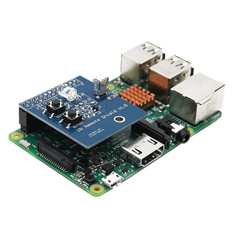

## Octopus Integration Tests Status Indicator

### Concept and Overview

One of our current projects includes a set of full system integration tests that are automatically executed when a new integration deployment takes place (which is also automated from new development builds). We wanted a simple way to get the status of these tests in front of all of the team and the rest of the business.

What we needed was a lamp that could change colour... maybe one of these


_Our team is called ThunderGods so a ghost makes sense... Honest._

It's IR controlled and has a number of different colours. Now all we need to something to monitor the status of our Octopus deployment / test execution and update the colour of the lamp dependent on the state.

Fortunately Octopus exposes an extensive API so being able to discover the state of the deployment wouldn't be difficult. All we need is something to send IR signals. The perfect platform for these kind of integration efforts is the Raspberry PI and it's extensive set of hardware addons includes an IR transmitter / receiver shield.



To be able to communicate with the lamp we need to know what the IR commands are that it uses. Fortunately it's a standard set that someone has [already mapped out for us](https://github.com/null-loop/octopus-monitor/blob/master/lircd.conf). 

This configuration is intended for us in LIRC (Linux Infrared Remote Control) which is compatible with Raspbian on the PI. Setting up LIRC can be _tricky_ but once done you can easily send commands to change the colour of the lamp or turn it on and off.

Then it was a case of tying all of this together in a python script.

### Shopping List

* One Raspberry PI
* One IR controlled LED lamp - we're using this [Pacman Ghost Lamp](https://www.amazon.co.uk/Pac-Man-Plastic-Ghost-Lamp-White/dp/B00IFC2YCC) - but anything that uses the same 24 key remote will work
* One IR Remote Shield - we're using this [shield](https://www.amazon.co.uk/gp/product/B07912JHDK/ref=oh_aui_detailpage_o01_s00?ie=UTF8&psc=1)

### Walk Through

Clone the git repository at [https://github.com/null-loop/octopus-monitor.git](https://github.com/null-loop/octopus-monitor.git) to `/home/pi/octopus-monitor`

Make sure you've got the `requests` Python package installed

```
$ pipenv install requests
```

Now install LIRC

```
$ sudo apt-get update
$ sudo apt-get install lirc
```

Add the following lines to the `/etc/modules` file:

```
lirc_dev
lirc_rpi gpio_in_pin=18 gpio_out_pin=17
```

Then add the following lines to `/etc/lirc/hardware.conf` file (create it if it does not exist already):

```
LIRCD_ARGS="--uinput --listen"
LOAD_MODULES=true
DRIVER="default"
DEVICE="/dev/lirc0"
MODULES="lirc_rpi"
```

Update / add the following line in `/boot/config.txt`

```
dtoverlay=lirc-rpi,gpio_in_pin=18,gpio_out_pin=17
```

Update the following lines in `etc/lirc/lirc_options.conf`

```
driver      = default
device      = /dev/lirc0
```

Stop and start lircd:

```
$ sudo /etc/init.d/lircd stop
$ sudo /etc/init.d/lircd start
```

You can check the status of lirc to ensure it's running

```
$ sudo /etc/init.d/lircd status
```

If everything's OK we need to reboot before we do further testing

```
$ sudo reboot
```

Once rebooted we can test that the lirc driver is working correctly

```
$ sudo /etc/init.d/lircd stop
$ mode2 -d /dev/lirc0
```

Now when you point a remote at the sensor and press a few buttons you'll see a sequence of received commands:

```
pulse 560
space 1706
pulse 535
etc...
```

Now we need to instruct lirc how to send the commands used by the lamp. Backup the existing config and copy over the one from the git repository.

```
$ sudo /etc/init.d/lircd stop
$ sudo mv /etc/lirc/lircd.conf /etc/lirc/lircd_original.conf
$ sudo cp /home/pi/octopus-monitor/lircd.conf /etc/lirc/lircd.conf
$ sudo /etc/init.d/lircd start
```

Once that is done we can send specific commands to the lamp

```
$ irsend SEND_ONCE LED_24_KEY RED
$ irsend SEND_ONCE LED_24_KEY GREEN
```

If all of this has worked you can now run the colour test from the python script

``` 
$ python /home/pi/octopus-monitor/monitor.py -colour-test on
```

If everything's OK you should see something like